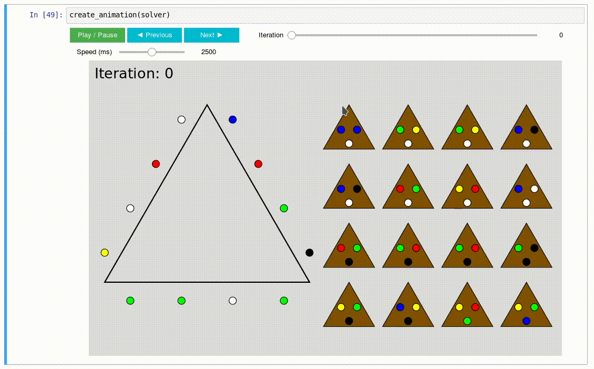

p5-jupyter-notebook
===========

[](https://mybinder.org/v2/gh/jtpio/p5-jupyter-notebook/master?filepath=puzzle.ipynb)

Jupyter Notebook to demonstrate how to use [p5.js](https://p5js.org) for custom interactive animations.

The Bermuda Triangle puzzle is used in the notebook as a concrete example to solve. But the idea and the tools can be applied to other cases.

> The Bermuda Triangle Puzzle is a wooden puzzle consisting of 1 big triangle and 16 smaller triangles of equal size. The goal of the puzzle is to arrange the triangles in a way so that each adjacent color is the same: red next to red, blue next to blue, and so on....

Here is a short animation of what the animation looks like. Refer to the [notebook](./puzzle.ipynb) for more details!




## Run on Binder

You can run the notebook directly on [Binder](https://mybinder.org/v2/gh/jtpio/p5-jupyter-notebook/master?filepath=puzzle.ipynb).

Binder creates a reproducible environment from the `environment.yml` file to ensure all dependencies are installed at startup.


## Run locally

```
git clone https://github.com/jtpio/p5-jupyter-notebook
cd p5-jupyter-notebook/
```

Create a conda environment and install the dependencies:

```
conda env create
source activate p5-notebook
```

Launch the notebook:
```
jupyter notebook
```

## ipyp5?

This notebook is more for the sake of experimenting with p5.js and creating a Jupyter Widget directly in the Jupyter Notebook.

There is however an initiative to create a proper `ipyp5` Jupyter Widgets (still early stages though!):

[https://github.com/jtpio/ipyp5](https://github.com/jtpio/ipyp5)
